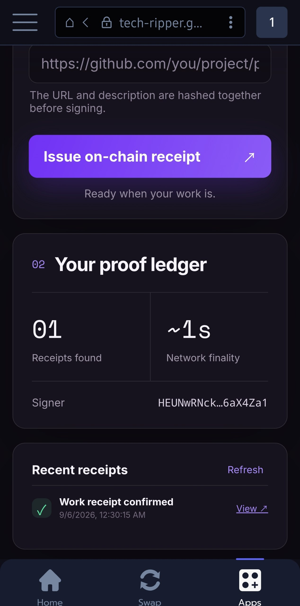

# ProofCrumb

**Live app:** https://tech-ripper.github.io/proofcrumb/

**Source:** https://github.com/tech-ripper/proofcrumb

**Verified production receipt:** https://cookiescan.io/tx/3oYkMA7ySFoUrstEU7BtZoU6s7EArpkgRJ54dcUyTX6ZN8f1oDoXqBA9oWEFmoc8bm7gZd9X7JpuPp4kPhePssfD



ProofCrumb creates tamper-evident proof-of-work receipts on **Cookie Chain**. A user connects a Wallet Standard-compatible wallet such as Nightly, describes completed work, links the public deliverable, and signs one memo transaction. The resulting CookieScan transaction URL is a permanent, independently verifiable delivery receipt.

## Why it is useful

Freelancers, DAOs, autonomous agents, and distributed teams often need lightweight evidence that a public artifact existed and was delivered at a particular time. ProofCrumb keeps that evidence on-chain without operating an account database or uploading private files.

## Receipt format

```text
PROOFCRUMB:v1:<base64url-json>
```

The JSON payload contains:

- `task` — public-safe work description
- `deliverable` — canonical HTTPS URL
- `completedAt` — ISO-8601 creation time
- `proof` — SHA-256 of the other fields

Memos are capped at 566 bytes. Inputs are validated before the wallet is asked to sign.

## Features

- Wallet Standard discovery with Nightly support
- Cookie Chain RPC health indicator
- Signed on-chain memo transaction
- Explicit confirmation and error states
- Recent ProofCrumb receipt discovery for the connected signer
- CookieScan explorer links
- Responsive, accessible interface

## Local development

Requirements: Node.js 22+ and npm 10+.

```bash
npm install
npm test
npm run dev
```

Open `http://127.0.0.1:5173`.

## Production build

```bash
npm run build
```

Static output is written to `dist/` and can be deployed to any static host.

## Network configuration

- RPC: `https://rpc.cookiescan.io`
- Explorer: `https://cookiescan.io`
- Memo program: `MemoSq4gqABAXKb96qnH8TysNcWxMyWCqXgDLGmfcHr`

A connected wallet needs a small amount of COOK for transaction fees. ProofCrumb never requests or stores a private key.

## Verification

```bash
npm test
npm run build
```

The suite covers deterministic receipt encoding, input safety, memo extraction, transaction construction, and the disconnected app shell.

## Security notes

- Only HTTPS deliverable URLs are accepted.
- Task text and deliverable URLs are public once signed; secrets and private client information must not be entered.
- Private keys stay inside the wallet.
- The app sends transactions only after an explicit wallet approval.

## License

MIT
